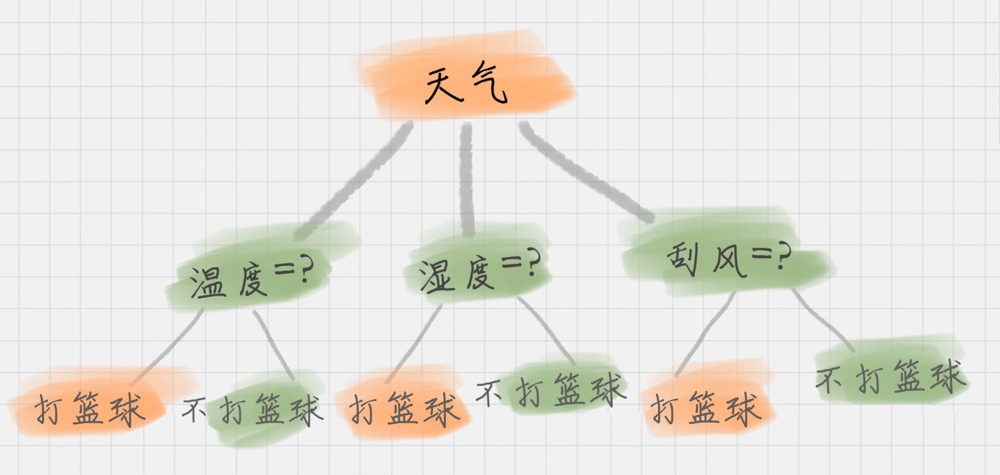
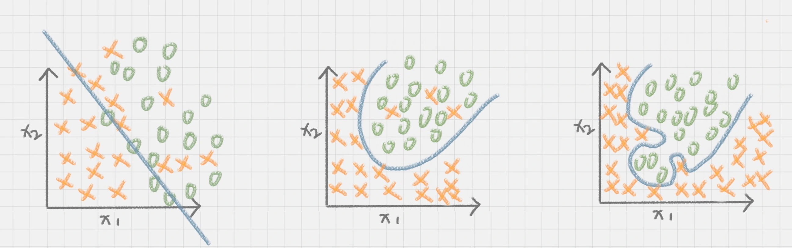
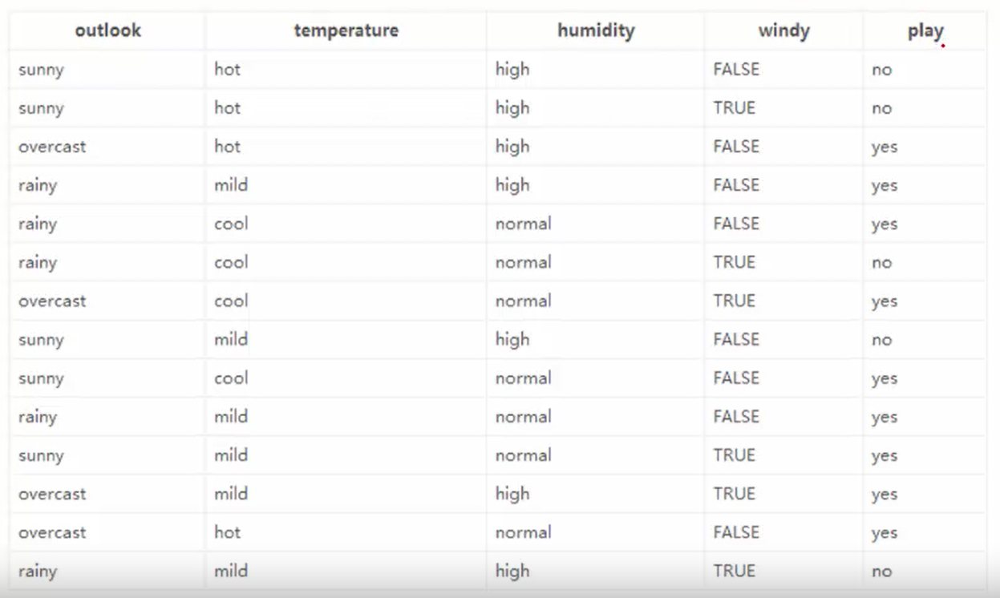
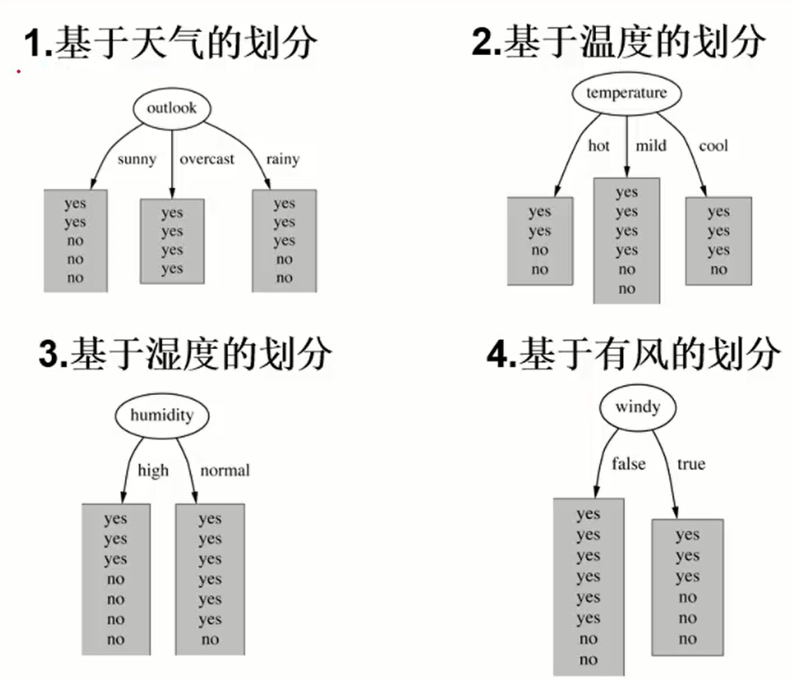

# 决策树

## 决策树的工作原理

决策树基本上就是把我们以前的经验总结出来。我给你准备了一个打篮球的训练集。如果我们要出门打篮球，一般会根据“天气”、“温度”、“湿度”、“刮风”这几个条件来判断，最后得到结果：去打篮球？还是不去？



上面这个图就是一棵典型的决策树。我们在做决策树的时候，会经历两个阶段：**构造**和**剪枝**。

***构造***

什么是构造呢？构造就是生成一棵完整的决策树。简单来说，构造的过程就是***选择什么属性作为节点的过程***，那么在构造过程中，会存在三种节点：

1. 根节点：就是树的最顶端，最开始的那个节点。在上图中，“天气”就是一个根节点；
2. 内部节点：就是树中间的那些节点，比如说“温度”、“湿度”、“刮风”；
3. 叶节点：就是树最底部的节点，也就是决策结果。

节点之间存在父子关系。比如根节点会有子节点，子节点会有子子节点，但是到了叶节点就停止了，叶节点不存在子节点。那么在构造过程中，你要解决三个重要的问题：

1. 选择哪个属性作为根节点；
2. 选择哪些属性作为子节点；
3. 什么时候停止并得到目标状态，即叶节点。

***剪枝***

决策树构造出来之后是不是就万事大吉了呢？也不尽然，我们可能还需要对决策树进行剪枝。剪枝就是给决策树瘦身，这一步想实现的目标就是，不需要太多的判断，同样可以得到不错的结果。之所以这么做，是为了防止“过拟合”（Overfitting）现象的发生。

“过拟合”这个概念你一定要理解，它指的就是模型的训练结果“太好了”，以至于在实际应用的过程中，会存在“死板”的情况，导致分类错误。
欠拟合，和过拟合就好比是下面这张图中的第一个和第三个情况一样，训练的结果“太好“，反而在实际应用过程中会导致分类错误。



造成过拟合的原因之一就是因为训练集中样本量较小。如果决策树选择的属性过多，构造出来的决策树一定能够“完美”地把训练集中的样本分类，但是这样就会把训练集中一些数据的特点当成所有数据的特点，但这个特点不一定是全部数据的特点，这就使得这个决策树在真实的数据分类中出现错误，也就是模型的“泛化能力”差。

泛化能力指的分类器是通过训练集抽象出来的分类能力，你也可以理解是举一反三的能力。如果我们太依赖于训练集的数据，那么得到的决策树容错率就会比较低，泛化能力差。因为训练集只是全部数据的抽样，并不能体现全部数据的特点。

既然要对决策树进行剪枝，具体有哪些方法呢？一般来说，剪枝可以分为“预剪枝”（Pre-Pruning）和“后剪枝”（Post-Pruning）。
预剪枝是在决策树构造时就进行剪枝。方法是在构造的过程中对节点进行评估，如果对某个节点进行划分，在验证集中不能带来准确性的提升，那么对这个节点进行划分就没有意义，这时就会把当前节点作为叶节点，不对其进行划分。

后剪枝就是在生成决策树之后再进行剪枝，通常会从决策树的叶节点开始，逐层向上对每个节点进行评估。如果剪掉这个节点子树，与保留该节点子树在分类准确性上差别不大，或者剪掉该节点子树，能在验证集中带来准确性的提升，那么就可以把该节点子树进行剪枝。方法是：用这个节点子树的叶子节点来替代该节点，类标记为这个节点子树中最频繁的那个类。

## 决策树相关定义

- 信息熵：**它表示了信息的不确定度。**

在信息论中，随机离散事件出现的概率存在着不确定性。为了衡量这种信息的不确定性，信息学之父香农引入了信息熵的概念，并给出了计算信息熵的数学公式：

$$Entropy = -\sum_{i=0}^{c-1}p(i|t)log_{2}p(i|t)$$

$p(i|t)$ 代表了节点 t 为分类 i 的概率，其中 $log2$ 为取以 2 为底的对数。这里我们不是来介绍公式的，而是说存在一种度量，它能帮我们反映出来这个信息的不确定度。当不确定性越大时，它所包含的信息量也就越大，信息熵也就越高。

$$\sum_{r=1}^nP_{i}ln(P_i)$$

- Gini系数

$$Gini系数 = Gini(p) = \sum_{k=1}^{K}p_{k}(1-p_k) = 1 - \sum_{k=1}^Kp_k^2$$

- 信息增益

信息增益，信息增益指的就是划分可以带来纯度的提高，信息熵的下降。它的计算公式，是父亲节点的信息熵减去所有子节点的信息熵。在计算的过程中，我们会计算每个子节点的归一化信息熵，即按照每个子节点在父节点中出现的概率，来计算这些子节点的信息熵。所以信息增益的公式可以表示为：

$$Gain(D, a) = Entropy(D) - \sum_{i=1}^k\frac{|D_i|}{|D|}Entropy(D_i)$$

## 实例

构造决策树的基本想法是随着数的深度的增加，节点的熵迅速的降低。熵降低的速度越快越好，这样就可以得到一棵高度最矮的决策树。

我们在构造决策树的时候，会基于纯度来构建。而经典的 “不纯度”的指标有三种，分别是信息增益（ID3 算法）、信息增益率（C4.5 算法）以及基尼指数（Cart 算法）。

***如何判断要不要去打篮球？***

**信息增益（ID3 算法）**

打篮球的数据集，训练数据如下：



在没有给定任何天气信息时，根据历史数据，我们只知道新的一天打球的概率时9/14，不打的概率是5/14，此时的熵值为：

$$-\frac{9}{14}log_2\frac{9}{14}-\frac{5}{14}log_2\frac{5}{14} = 0.940$$

属性有四个：outlook、temperature、humidity、windy。我们首先要决定哪个属性作为树的根节点。

对每项指标分别统计：在不同的取值下打球和不打球的次数



- 当已知变量为outlook时，信息熵：

outlook = sunny时，2/5的概率打球，3/5的概率不打球。

$$-\frac{2}{5}log_2\frac{2}{5}-\frac{3}{5}log_2\frac{3}{5} = 0.971$$

outlook = overcast时，4/4的概率打球。

$$-\frac{4}{4}log_2\frac{4}{4}-\frac{0}{0}log_2\frac{0}{0} = 0$$

outlook = rainy时，2/5的概率不打球，3/5的概率打球。

$$-\frac{2}{5}log_2\frac{2}{5}-\frac{3}{5}log_2\frac{3}{5} = 0.971$$

而根据历史统计数据，outlook取值为sunny、overcast、rainy的概率分别为5/14，4/14，5/14，所以当已知变量为outlook的值时，信息熵为：

$$\frac{5}{14}*0.971 + \frac{4}{14}*0 + \frac{5}{14}*0.971 = 0.693$$

这样的话，系统熵值从0.940下降到0.693，信息增益Gain(outlook)为0.940-0.693=0.247。

同样可以计算出Gain(temperature)=0.029，Gain(humidity)=0.152，Gain(windy)=0.048。

Gain(outlook)最大(即outlook在第一步使系统的信息熵下降的最快)，所以决策树的根节点就取outlook。

**信息增益率（C4.5 算法）**

$$Gain_ratio(outlook) = \frac{Gain(outlook)}{Entropy(outlook)} = \frac{Entropy-Entropy(outlook)}{Entropy(outlook)} = \frac{0.247}{0.971}$$

- Gain_ratio(outlook)为outlook的信息增益率
- Gain(outlook)：outlook的信息增益
- Entropy(outlook)：outlook的信息熵
- Entropy：系统熵

**基尼指数（Cart 算法）**

$$Gini系数 = Gini(p) = \sum_{k=1}^{K}p_{k}(1-p_k) = 1 - \sum_{k=1}^Kp_k^2$$


```
Gini(X,A) 
    = p(sunny) * Gini(X|outlook=sunny)
      +
      p(overcast) * Gini(X|outlook=overcast)
      +
      p(rainy) * Gini(X|outlook=rainy)
    = p(sunny) * {1 - [p(play=yes|sunny)^2 + p(play=no|sunny)^2]}
      + 
      p(overcast) * {1 - [p(play=yes|overcast)^2 + p(play=no|overcast)^2]}
      +
      p(rainy) * {1 - [p(play=yes|rainy)^2 + p(play=no|rainy)^2]}
    = 5/14 * {1 - [(2/5)^2 + (3/5)^2]}
      +
      4/14 * {1 - [1]}
      +
      5/14 * {1 - [(3/5)^2 + (2/5)^2]}
    = 0.343
```

## 总结

**信息增益（ID3 算法）**的缺点

如果我们把“编号”作为一个属性（一般情况下不会这么做，这里只是举个例子），那么“编号”将会被选为最优属性 。但实际上“编号”是无关属性的，它对“打篮球”的分类并没有太大作用。

所以 ID3 有一个缺陷就是，有些属性可能对分类任务没有太大作用，但是他们仍然可能会被选为最优属性。这种缺陷不是每次都会发生，只是存在一定的概率。在大部分情况下，ID3 都能生成不错的决策树分类。针对可能发生的缺陷，后人提出了新的算法进行改进。

**信息增益（ID3 算法）** 与 **信息增益率（C4.5 算法）** 比较

- ID3 算法的优点是方法简单，缺点是对噪声敏感。训练数据如果有少量错误，可能会产生决策树分类错误。
- C4.5 在 ID3 的基础上，用信息增益率代替了信息增益，解决了噪声敏感的问题，并且可以对构造树进行剪枝、处理连续数值以及数值缺失等情况，但是由于 C4.5 需要对数据集进行多次扫描，算法效率相对较低。